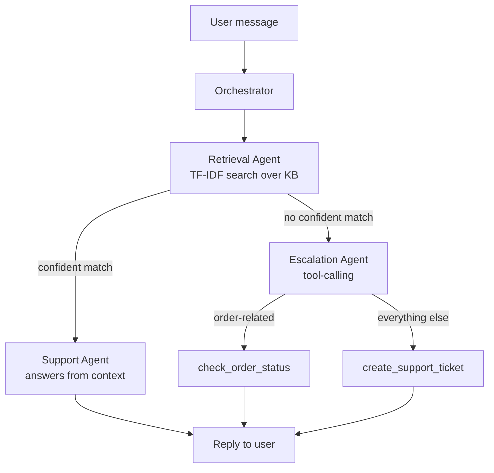

# Multi-Agent AI Support Bot

🔗 **[Live Demo](https://multi-agent-support-bot.onrender.com)** · [GitHub](https://github.com/MOHAMMADSHADULLA/multi-agent-support-bot)

> Note: hosted on Render's free tier, which sleeps after 15 min of inactivity — the first request may take 30-60 seconds to wake up.

A customer-support chatbot for a travel-booking platform (TravelZone),
built around a small team of cooperating agents instead of one monolithic
prompt: a **Retrieval agent** grounds answers in a real knowledge base, a
**Support agent** generates the reply, and an **Escalation agent** takes
over — using real tool/function calling — when the knowledge base can't
help, either filing a support ticket or looking up an order.

Built to be provider-agnostic: swap between **OpenAI** and **Google
Gemini** with one environment variable, no code changes.

## Why this architecture

A single "answer everything" LLM call can't do RAG grounding, decide when
it doesn't know something, *and* reliably call the right tool — it either
hallucinates unclear answers or over-triggers tools. Splitting the work
into agents with one job each makes every step inspectable and testable
independently (see `tests/`), which is also just good engineering practice
for anything going into production.



## Project layout

```
app/
  agents/
    orchestrator.py       # routes each message to Support or Escalation
    retrieval_agent.py     # TF-IDF search + confidence scoring
    support_agent.py       # LLM call grounded in retrieved context
    escalation_agent.py    # LLM tool-calling for tickets/order lookups
  data/                    # knowledge base (markdown FAQs)
  static/index.html        # demo chat widget (vanilla HTML/CSS/JS)
  rag.py                   # chunking + TF-IDF retriever
  tools.py                 # mock ticket + order-lookup tool implementations
  llm_client.py             # unified OpenAI / Gemini / mock client
  config.py                # env-driven settings
  main.py                  # FastAPI app (/chat, /health, static widget)
tests/                     # pytest suite covering RAG, agents, and API
.github/workflows/ci.yml   # lint/test/build on every push
Dockerfile
```


## Why TF-IDF instead of a hosted embeddings API

The retrieval layer uses scikit-learn TF-IDF + cosine similarity rather
than OpenAI/Gemini embeddings or a vector database. That's a deliberate
choice for a project this size: it needs zero API keys to run and test,
starts instantly, and still exercises the real RAG pattern end to end
(chunk → index → retrieve → ground the answer). `app/rag.py` is the only
file that would need to change to swap in real embeddings + a vector
store like Chroma or pgvector for a larger knowledge base.

## Running locally

```bash
python -m venv venv && source venv/bin/activate
pip install -r requirements.txt
cp .env.example .env          # defaults to LLM_PROVIDER=mock, no key needed
uvicorn app.main:app --reload
```

Open http://localhost:8000 for the chat widget, or call the API directly:

```bash
curl -X POST http://localhost:8000/chat \
  -H "Content-Type: application/json" \
  -d '{"message": "How do I cancel a booking?"}'
```

### Using a real LLM

Set `LLM_PROVIDER=openai` and `OPENAI_API_KEY=...` (or `LLM_PROVIDER=gemini`,
`GEMINI_API_KEY=...`, and `GEMINI_MODEL=gemini-3.6-flash`) in `.env`. The
mock provider (default) needs no key and is what CI runs against, so the
pipeline is fully testable without paying for API calls.

## Running with Docker

```bash
docker build -t support-bot .
docker run -p 8000:8000 -e LLM_PROVIDER=mock support-bot
```

## Tests

```bash
pytest -v
```

16 tests cover the retriever's relevance scoring, each agent in isolation,
the full orchestration routing logic, and the HTTP API.

## Deploying

Any container host works since it's a single Dockerfile with no external
dependencies beyond the LLM API:
- **Render / Railway / Fly.io** — point at the Dockerfile, set
  `LLM_PROVIDER` + API key as env vars, done. (This project is currently
  deployed on Render — see the live demo link above.)
- **AWS** — push the image to ECR and run on ECS Fargate or App Runner;
  or run `docker build` directly on an EC2 instance behind an ALB.

## Example interactions

| Message | Route | What happens |
|---|---|---|
| "How do I cancel a booking?" | Support | Answered from `bookings.md`, cites source |
| "Check order A1001" | Escalation → `check_order_status` | Looks up the mock order |
| "My spaceship warranty is void" | Escalation → `create_support_ticket` | Files a ticket, returns a ticket ID |

## Possible extensions

- Swap TF-IDF for OpenAI/Gemini embeddings + Chroma for a larger KB
- Persist tickets/conversations to a real database instead of in-memory mocks
- Add a streaming `/chat` endpoint (SSE) for token-by-token replies
- Wire `create_support_ticket` to a real helpdesk API (Zendesk, Freshdesk)